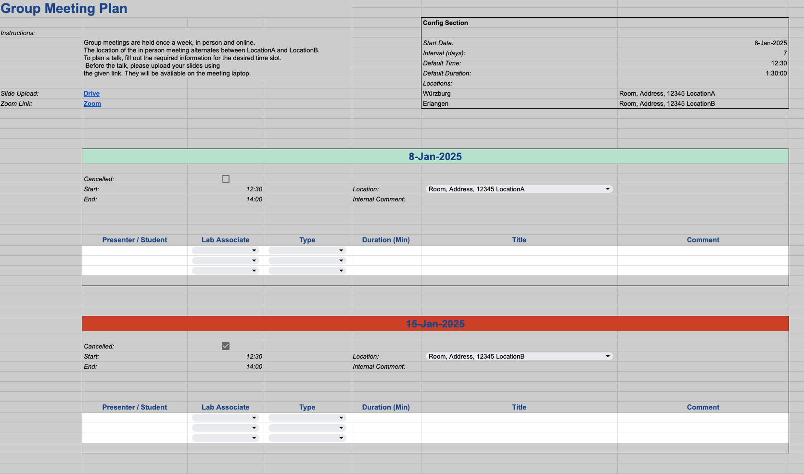

# Lab Meeting Manager

Repository to automatically notify team members about the agenda of the next weekly group meeting, based on a shared Google Sheet. Supports notification via Email and Matrix chat.

The meeting manager is built around a shared Google Docs spreadsheet, where team members enter the talks they (or their students) plan. The meeting manager then sends an agenda message via the specified channels to the given recipients at a specified time, for example, every Monday. It can handle multiple meetings in one week. A sample spreadsheet that works without adjustments can be provided upon request. If the document structure is changed (e.g., what is in which row or column), the corresponding code must be updated accordingly.

## Requirements:
- requirements.txt
- Google Sheet and API access (see [Instructions](https://developers.google.com/sheets/api/quickstart/python)).
- For email notification: An email account (SMTP server, username, etc.)
- For Matrix notification:
    - A Matrix account (access token, room ID, etc.). Create via [Element](https://app.element.io)
    - Install [matrix-notifier](https://github.com/Mo-Sc/matrix-notifier)

## Setup

The configuration is mainly done via the `config.py`. For a detailed description of the parameters, check the file.
- **NotificationsConfig**: General configurations, like which channels to use and which week's agenda to compile.
- **SMTPConfig**: Configuration of the email server.
- **GSheetConfig**: Configuration of the Google Sheet API.


### Credential Files

Each channel has a separate json file that can be used to store confidential data. The path to those files have to be set in the config file.

**Email:**
```
{"username": "user@email.com", "password": "password"}
```

**GSheet:**

The GSheet `credentials.json` file can be downloaded when creating the [API access](https://developers.google.com/sheets/api/quickstart/python).

**Matrix:**

For the Matrix credentials file, check the [matrix-notifier](https://github.com/Mo-Sc/matrix-notifier) repository.

### Spreadsheet
A template for the spreadsheet can be provided upon request.



Recommended use:
- Share the document with all team members. Make white cells writable by the team, gray cells only by the admin.
- Each member can add meetings to the rows.
- When a meeting is canceled, check the canceled box. The meeting manager will then send a "meeting canceled" notification.
- Use Data Validation and conditional formatting to limit possible input (e.g., the "Associate" field only allows team members).
- Don't insert, modify, or delete rows or columns; otherwise, the corresponding variables in the code must be adapted.
- By default, the meeting will be scheduled with date, time, duration and location as given in the config section day at the top of the spreadsheet. This can be overwritten for an individual meeting by changing the values in the meeting's box.

## Run
After setting up the configuration, start the script by running the `main.py` file.

Alternatively, you can set up a cron job to send out the meeting agenda periodically, e.g., every Friday at 5 PM:
- Open the crontab file: `crontab -e`
- Add the following line: `0 17 * * 5 /usr/bin/python3 /path/to/lab_meeting_manager/main.py`
- (`0 17 * * 5` means 5:00 PM every Friday.)

## Upcoming
Integration with Outlook, creating .ical files, etc.
